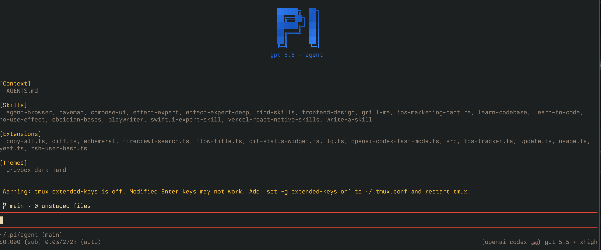

my pi setup

_i don't actually recommend u use this setup. it's just a reference at what's possible_

## if u really want to use it

1. clone this repo to `~/.pi/agent`
2. install the packages in there (idk if this actually matters)
3. (optional) if u want the web search tools, need to get a firecrawl api key and put it in `.env`

## what u actually should do

1. install pi: https://pi.dev
2. open it, then run "/login" with codex. then pick gpt-5.5 with low reasoning (press tab to cycle reasoning levels)
3. try it, anytime u find urself wanting something make a new pi instance and ask it to make it for u. I'm serious try it, it just magically works
# pi-agent
