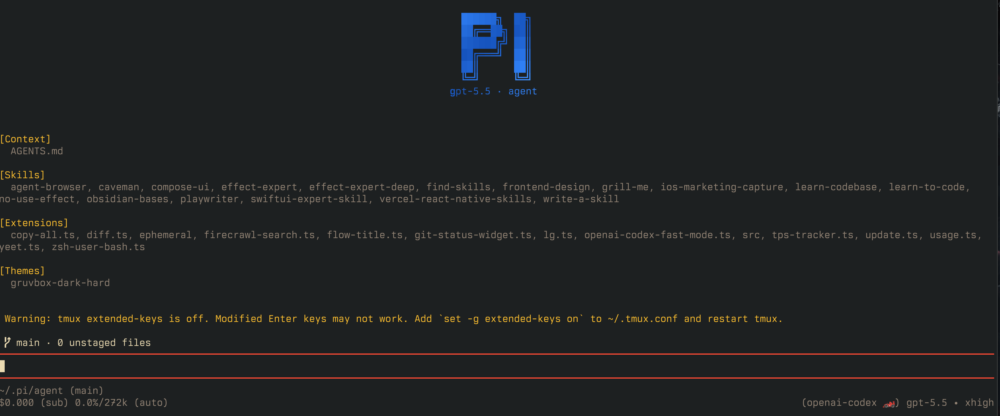

# 🥧 Pi Agent Setup

A personalized [Pi](https://pi.dev) AI coding agent configuration with custom extensions, commands, themes, and MCP integration.

> **Disclaimer:** This is a personal setup, not a recommended configuration. It's a reference for what's possible with Pi's extension system.



---

## Table of Contents

- [What is Pi?](#what-is-pi)
- [Getting Started](#getting-started)
- [Configuration (`settings.json`)](#configuration-settingsjson)
- [Thinking Levels / Effort](#thinking-levels--effort)
- [Extensions (Plugins)](#extensions-plugins)
- [Commands (Controllers)](#commands-controllers)
- [MCP Integration](#mcp-integration)
- [Secret Masking (`cloak.json`)](#secret-masking-cloakjson)
- [Themes](#themes)
- [File Layout](#file-layout)

---

## What is Pi?

[Pi](https://pi.dev) is a terminal-based AI coding assistant with read, bash, edit, and write tools. It supports a powerful extension system that lets you add custom tools, commands, UI widgets, event hooks, and MCP server integration — all via TypeScript files.

---

## Getting Started

1. **Install Pi:** Visit <https://pi.dev> and follow the installation instructions.
2. **Clone this repo** to `~/.pi/agent`:
   ```sh
   git clone https://github.com/makyinmars/pi-agent.git ~/.pi/agent
   ```
3. **Install dependencies:**
   ```sh
   cd ~/.pi/agent && pnpm install
   cd extensions/web-tools && npm install
   cd extensions/pi-skill-toggle && npm install
   cd extensions/save-md && npm install
   ```
4. **Login:** Open Pi and run `/login` with your provider (e.g., Codex). Pick a model and you're ready.

---

## Configuration (`settings.json`)

The main configuration file is `~/.pi/agent/settings.json`:

```json
{
  "lastChangelogVersion": "0.81.1",
  "defaultProvider": "openai-codex",
  "defaultModel": "gpt-5.6-sol",
  "defaultThinkingLevel": "high",
  "theme": "gruvbox-dark-hard",
  "packages": ["npm:@plannotator/pi-extension"],
  "hideThinkingBlock": true
}
```

| Key | Description |
|-----|-------------|
| `defaultProvider` | The AI provider to use (e.g., `openai-codex`, `google`, `anthropic`). |
| `defaultModel` | The default model ID (e.g., `gpt-5.6-sol`). |
| `defaultThinkingLevel` | Controls the reasoning/effort level. See [Thinking Levels](#thinking-levels--effort). |
| `theme` | The UI theme to load from `themes/`. |
| `packages` | NPM packages to load as Pi extensions. |
| `hideThinkingBlock` | When `true`, hides the model's thinking/reasoning output in the TUI. |

You can also override settings per-launch with CLI flags:
```sh
pi --thinking high --model gpt-5.6-sol --provider openai-codex
```

---

## Thinking Levels / Effort

Pi supports configurable reasoning/effort levels. You can change them three ways:

| Method | How |
|--------|-----|
| **Config file** | Set `"defaultThinkingLevel"` in `settings.json` |
| **CLI flag** | `pi --thinking high` |
| **Keyboard (TUI)** | Press `Tab` to cycle through levels interactively |

Valid levels (lowest to highest):

| Level | Description |
|-------|-------------|
| `off` | No reasoning tokens |
| `minimal` | Bare minimum thinking |
| `low` | Light reasoning |
| `medium` | Balanced |
| `high` | Deep reasoning |
| `xhigh` | Extra deep reasoning |
| `max` | Maximum reasoning budget |

---

## Extensions (Plugins)

Extensions are TypeScript files in `extensions/` that hook into Pi's lifecycle. They can register **tools**, **commands**, **UI widgets**, **event handlers**, and **flags**.

### Extension Overview

| File / Package | Type | Source | Description |
|----------------|------|--------|-------------|
| [`answer.ts`](extensions/answer.ts) | Command + TUI | dmmulroy | Interactive Q&A extractor — scans AI replies for questions, opens a TUI form to answer them |
| [`continue-after-compaction.ts`](extensions/continue-after-compaction.ts) | Event hook | dmmulroy | Auto-resumes work after context compaction by reading the saved session and continuing |
| [`whimsical.ts`](extensions/whimsical.ts) | UI + Event hooks | dmmulroy | Replaces the working spinner with random funny status messages |
| [`herdr-agent-state.ts`](extensions/herdr-agent-state.ts) | Event hooks | Herdr | Reports agent state (working/blocked/idle) to Herdr via Unix socket |
| [`diff.ts`](extensions/diff.ts) | Command + Event hooks | custom | Tracks files changed during agent runs and opens them in Zed |
| [`copy-all.ts`](extensions/copy-all.ts) | Command | custom | Copies all conversation messages to clipboard |
| [`flow-title.ts`](extensions/flow-title.ts) | UI Header + Command | custom | Animated blue gradient ASCII "Pi" header with live model/project info |
| [`git-status-widget.ts`](extensions/git-status-widget.ts) | UI Widget | custom | Status bar widget showing current git branch and unstaged file count |
| [`tps-tracker.ts`](extensions/tps-tracker.ts) | UI Status + Events | custom | Tracks and displays tokens-per-second during model generation |
| [`openai-codex-fast-mode.ts`](extensions/openai-codex-fast-mode.ts) | Event hooks | custom | Enables OpenAI priority service tier for Codex models, shows 🏎️ indicator |
| [`update.ts`](extensions/update.ts) | Command + Flag | custom | Updates Pi using the detected install method (vp, bun, npm, brew, or native) |
| [`usage.ts`](extensions/usage.ts) | Command | custom | Generates a detailed usage/cost report across 1/7/30/90 day windows |
| [`yeet.ts`](extensions/yeet.ts) | Command | custom | One-shot "add, commit, and push" with auto-generated commit messages |
| [`lg.ts`](extensions/lg.ts) | Command | custom | Summarizes unstaged git changes with per-file +/- line counts |
| [`zsh-user-bash.ts`](extensions/zsh-user-bash.ts) | Event hook | custom | Runs bash commands through zsh with proper shell configuration |
| [`pi-cloak/`](extensions/pi-cloak/) | Tool hook | dmmulroy | Masks secrets in read tool output using `cloak.json` patterns |
| [`pi-skill-toggle/`](extensions/pi-skill-toggle/) | Command + TUI | dmmulroy | Interactive TUI for toggling Pi skills on/off via frontmatter |
| [`save-md/`](extensions/save-md/) | Command | dmmulroy | Saves the latest assistant response as a Markdown file |
| [`web-tools/`](extensions/web-tools/) | Tools | dmmulroy | Web fetch and search tools with SSRF protection and Exa search |
| [`pi-mcp/`](extensions/pi-mcp/) | Extension package | custom | MCP adapter with OAuth support for connecting to MCP servers |
| [`ephemeral/`](extensions/ephemeral/) | Extension package | custom | Ephemeral patching system with catalog, project state, and TUI |

### Extension Details

#### 💬 `answer.ts` — Interactive Q&A Extractor
When you press `Ctrl+.` or type `/answer`:
1. Finds the latest assistant message on the active session branch
2. Uses a cheap model (gpt-5.5, falling back to Claude Haiku) to extract any unanswered questions
3. Falls back to regex extraction if the model output is malformed
4. Opens a custom interactive TUI questionnaire (Tab/Enter to advance, Shift+Tab to go back, Shift+Enter for newlines)
5. Sends your answers as a follow-up message

#### 🔄 `continue-after-compaction.ts` — Auto-Resume After Compaction
Listens for `session_compact` events and automatically sends a continuation prompt instructing the model to:
- Read the persisted JSONL session file
- Follow `parentId` links to recover the original task, constraints, changes, tests, and next action
- Reconcile with the current worktree and immediately continue

#### 🎭 `whimsical.ts` — Funny Status Messages
Replaces Pi's working indicator with random humorous messages on each turn, such as:
- `Schlepping...`
- `Tokenmaxxing...`
- `Consulting the void...`
- `Bribing the compiler...`
- `Making illegal states unrepresentable...`

#### 🤖 `herdr-agent-state.ts` — Herdr Integration
Reports agent lifecycle state (`working`, `blocked`, `idle`) to Herdr via Unix socket. Only activates when `HERDR_ENV=1` and `HERDR_SOCKET_PATH` are set.

#### 📝 `diff.ts` — Changed File Tracker
- Hooks into `agent_start`, `tool_result`, and `agent_end` events to track files modified during each agent run.
- Registers the `/diff` command to list and open changed files in [Zed](https://zed.dev).
- Supports `/diff list` (inline listing) and `/diff clear` (reset tracking).

#### 📋 `copy-all.ts` — Conversation Copier
- Registers `/copy-all` to copy all user and assistant messages from the current session to the clipboard (via `pbcopy` on macOS).

#### 🌊 `flow-title.ts` — Animated Gradient Header
- Replaces Pi's default header with an animated blue gradient ASCII art "Pi" logo.
- Shows the current model ID and project name in the subtitle.
- Updates live on model selection changes.
- Commands: `/flow-title` (enable) and `/flow-title-builtin` (restore default header).

#### 📊 `git-status-widget.ts` — Git Status Widget
- Displays a status bar widget with the current git branch and unstaged file count.
- Polls every 2 seconds and refreshes on input and tool execution events.

#### ⏱️ `tps-tracker.ts` — Tokens Per Second Tracker
- Tracks tokens-per-second during model generation in real-time.
- Shows live TPS in the status bar during generation.
- Reports final TPS statistics (total tokens, streaming time) at the end of each agent run.

#### 🏎️ `openai-codex-fast-mode.ts` — Priority Mode
- Intercepts `before_provider_request` events to set `service_tier: "priority"` on OpenAI Codex Responses API calls.
- Patches the footer component to display a 🏎️ emoji next to the provider name when fast mode is active.

#### 🔄 `update.ts` — Self-Updater
- Registers `/update` command and `--update` flag.
- Auto-detects the installation method (vite-plus, bun, npm, brew, or native binary).
- Retries transient failures (timeouts, 429s, 502/503/504s) up to 3 times.
- Reports before/after version numbers.

#### 💰 `usage.ts` — Usage & Cost Report
- Registers `/usage` command.
- Sends a detailed prompt that makes the agent parse Pi session files and Codex CLI sessions to produce a markdown cost report.
- Covers 1-day, 7-day, 30-day, and 90-day windows with per-model token counts and USD pricing from [models.dev](https://models.dev).

#### 🚀 `yeet.ts` — Quick Commit & Push
- Registers `/yeet` command.
- Adds all changes, auto-generates a commit message, commits, and pushes to the current branch.
- Handles upstream tracking setup and outputs remote/PR URLs.
- Accepts additional instructions as arguments: `/yeet fix the typo in README`.

#### 📈 `lg.ts` — Local Git Summary
- Registers `/lg` command.
- Sends a prompt that makes the agent summarize unstaged changes with per-file +/- line counts.

#### 🐚 `zsh-user-bash.ts` — Zsh Shell Integration
- Hooks into `user_bash` events to route bash commands through zsh.
- Uses `zsh -fc` (non-interactive) to avoid powerlevel10k/gitstatus warnings.
- Respects `PI_USER_BASH_SHELL` env var and `$SHELL` for custom shell paths.

#### 🔒 `pi-cloak/` — Secret Masking
Masks secrets in `read` tool output using patterns defined in [`cloak.json`](#secret-masking-cloakjson). Supports:
- File glob matching (`**/*.env*`, `~/.pi/agent/auth.json`, etc.)
- Regex-based value redaction with configurable replacement templates and cloak characters
- Per-line processing and session-start config reload
- `/cloak-status` command to check active patterns
- Does **not** modify files — only transforms tool output before the model sees it

#### 🎚️ `pi-skill-toggle/` — Skill Manager TUI
Interactive TUI for toggling Pi skills on/off. Run `/toggle-skills` to:
1. Scan skill directories (`~/.pi/agent/skills`, `~/.agents/skills`, project `.pi/skills`)
2. See a searchable list with source, path, description, and current mode
3. Press Space to toggle between `agent-invocable` and `manual-only`
4. Press `Ctrl+S` to apply changes atomically and reload Pi

#### 💾 `save-md/` — Save Assistant Response
Run `/save-md <name>` to extract text from the AI's latest reply and save it as a Markdown file in the current directory. Refuses to overwrite existing files.

#### 🌐 `web-tools/` — Web Fetch & Search
Two tools with a strong security layer:

- **`webfetch`** — Fetches a URL and returns Markdown, text, raw HTML, or inline images. HTML-to-Markdown pipeline uses LinkeDOM + Turndown/GFM with readability scoring.
- **`websearch`** — Searches the web via [Exa](https://exa.ai) with normalized results (title, URL, snippet, date, score). 1–20 results, auto/fast/deep depth modes.

Security features:
- Blocks private/localhost IPs (full IPv4 + IPv6 range checks including loopback, link-local, CGNAT, ULA)
- Rejects URLs with embedded credentials
- Response size limiting (5 MiB max)
- Manual redirect following with bounds (max 5)
- DNS resolution checks against private ranges

#### 🔌 `pi-mcp/` — MCP Adapter
Full MCP (Model Context Protocol) adapter with OAuth support. Provides server management, tool registration, resource tools, UI panel, and consent management.

#### 📦 `ephemeral/` — Ephemeral Patching System
Patch application system with catalog, project state tracking, and TUI for browsing/applying patches.

---

## Commands (Controllers)

All slash commands registered by extensions:

| Command | Extension | Description |
|---------|-----------|-------------|
| `/answer` | answer | Extract and answer questions from the AI's last reply (`Ctrl+.`) |
| `/diff` | diff | Open changed files in Zed |
| `/diff list` | diff | List changed files inline |
| `/diff clear` | diff | Clear the changed file tracker |
| `/copy-all` | copy-all | Copy all messages to clipboard |
| `/flow-title` | flow-title | Enable the animated gradient header |
| `/flow-title-builtin` | flow-title | Restore Pi's built-in header |
| `/toggle-skills` | pi-skill-toggle | Open interactive skill toggle TUI |
| `/save-md <name>` | save-md | Save the AI's last reply as a Markdown file |
| `/cloak-status` | pi-cloak | Show active secret masking patterns |
| `/update` | update | Update Pi to the latest version |
| `/usage` | usage | Generate a usage/cost report |
| `/yeet` | yeet | Add, commit, and push changes |
| `/yeet <msg>` | yeet | Same with additional instructions |
| `/lg` | lg | Summarize unstaged git changes |

**Tools** (auto-invoked by the AI, not typed):

| Tool | Extension | Description |
|------|-----------|-------------|
| `webfetch` | web-tools | Fetch a URL as markdown/text/images |
| `websearch` | web-tools | Search the web via Exa |

**Flags:**

| Flag | Extension | Description |
|------|-----------|-------------|
| `--update` | update | Run `/update` at session start |

**Keyboard Shortcuts:**

| Key | Extension | Description |
|-----|-----------|-------------|
| `Ctrl+.` | answer | Open the Q&A extractor |
| `Tab` | built-in | Cycle thinking levels |
| `Space` | pi-skill-toggle | Toggle skill in the TUI |
| `Ctrl+S` | pi-skill-toggle | Apply skill changes and reload |

---

## MCP Integration

MCP servers are configured in `mcp.json` with proxy tool mode and lazy startup:

```json
{
  "mcp": {
    "toolMode": "proxy",
    "startup": "lazy",
    "servers": { ... }
  }
}
```

The `extensions/pi-mcp/` directory contains a full MCP adapter with OAuth support for connecting to and managing MCP servers, registering their tools, and managing consent.

---

## Secret Masking (`cloak.json`)

The `cloak.json` file configures the `pi-cloak` extension to mask secrets in tool output. Patterns cover:

- `.env` and `.vars` files — strips values after `=`
- `auth.json` files — masks tokens, passwords, secrets
- OpenCode JSON `apiKey` fields
- TOML `token` fields
- Cloudflare Access fields

Example pattern:
```json
{
  "filePattern": "**/*.env*",
  "cloakPattern": "(=).+",
  "replace": "$1"
}
```

Run `/cloak-status` to see active patterns.

---

## Themes

Custom themes live in `themes/`. The current theme is `gruvbox-dark-hard` (a Gruvbox dark variant with hard contrast).

---

## File Layout

```
~/.pi/agent/
├── settings.json          # Main configuration
├── cloak.json             # Secret masking patterns for pi-cloak
├── mcp.json               # MCP server configuration
├── .env                   # API keys (gitignored)
├── .env.example           # Template for .env
├── .gitignore             # Ignores sessions, auth, .env, node_modules
├── AGENTS.md              # Coding standards for agent-assisted work
├── README.md              # This file
├── package.json           # NPM dependencies
├── pnpm-lock.yaml         # Lock file
├── assets/
│   └── preview-maky.png   # Preview screenshot
├── extensions/
│   ├── answer.ts          # Interactive Q&A extractor (Ctrl+.)
│   ├── continue-after-compaction.ts  # Auto-resume after compaction
│   ├── whimsical.ts       # Funny working status messages
│   ├── herdr-agent-state.ts  # Herdr agent state reporting
│   ├── diff.ts            # Changed file tracker + Zed opener
│   ├── copy-all.ts        # Copy conversation to clipboard
│   ├── flow-title.ts      # Animated gradient ASCII header
│   ├── git-status-widget.ts  # Git branch + unstaged count widget
│   ├── tps-tracker.ts     # Tokens-per-second tracker
│   ├── openai-codex-fast-mode.ts  # OpenAI priority service tier
│   ├── update.ts          # Self-updater
│   ├── usage.ts           # Usage/cost report generator
│   ├── yeet.ts            # Quick commit & push
│   ├── lg.ts              # Unstaged git change summary
│   ├── zsh-user-bash.ts   # Zsh shell integration
│   ├── pi-cloak/          # Secret masking extension
│   ├── pi-skill-toggle/   # Skill toggle TUI extension
│   ├── save-md/           # Save response as Markdown
│   ├── web-tools/         # Web fetch + search with SSRF protection
│   ├── pi-mcp/            # MCP adapter with OAuth
│   └── ephemeral/         # Ephemeral patching system
├── themes/                # Custom UI themes
├── sessions/              # Session storage (gitignored)
└── npm/                   # NPM cache (gitignored)
```

---

## Credits

- [Pi](https://pi.dev) by Mario Zechner
- Extensions adapted from [dmmulroy/.dotfiles](https://github.com/dmmulroy/.dotfiles): `answer.ts`, `continue-after-compaction.ts`, `whimsical.ts`, `pi-cloak`, `pi-skill-toggle`, `save-md`, `web-tools`
- [Herdr](https://herdr.dev) for agent state management
- [Exa](https://exa.ai) for web search
- [models.dev](https://models.dev) for pricing data
